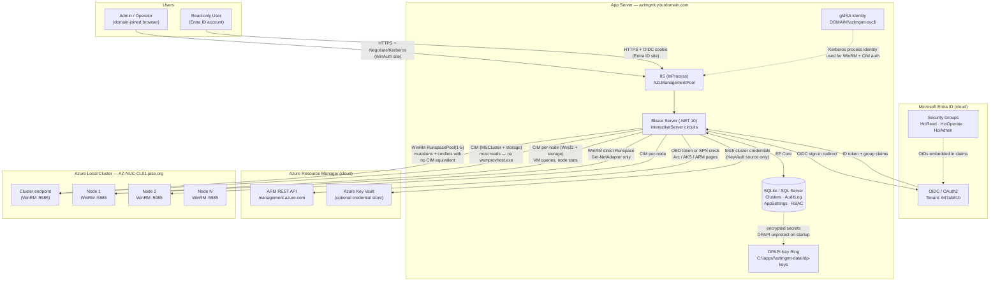
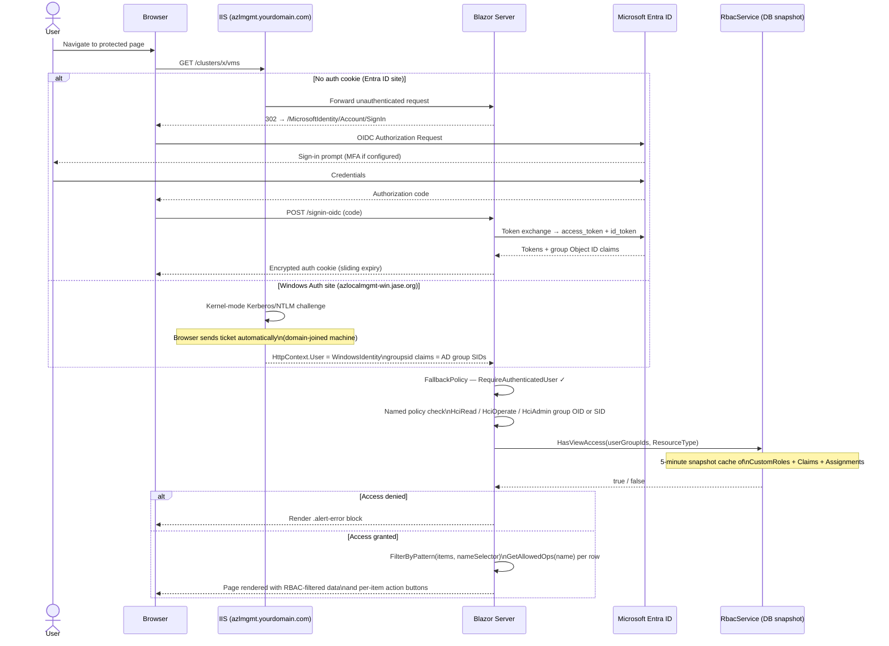
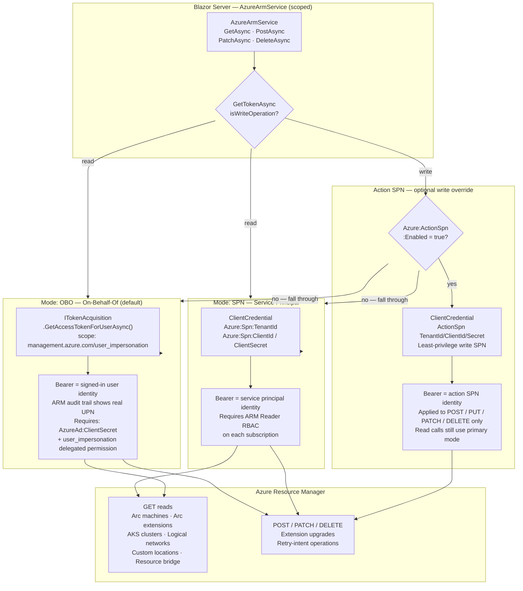
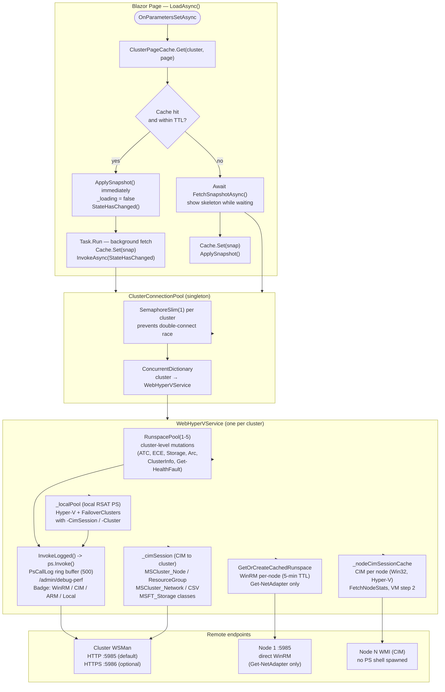
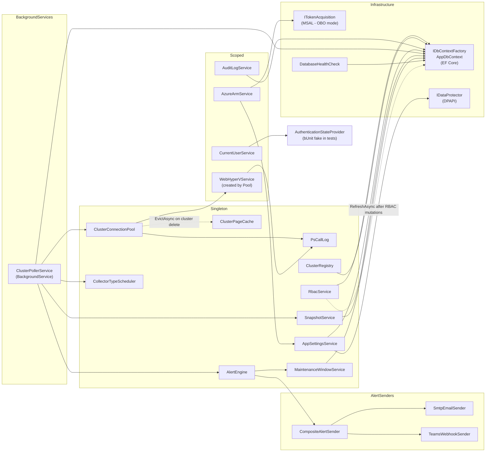
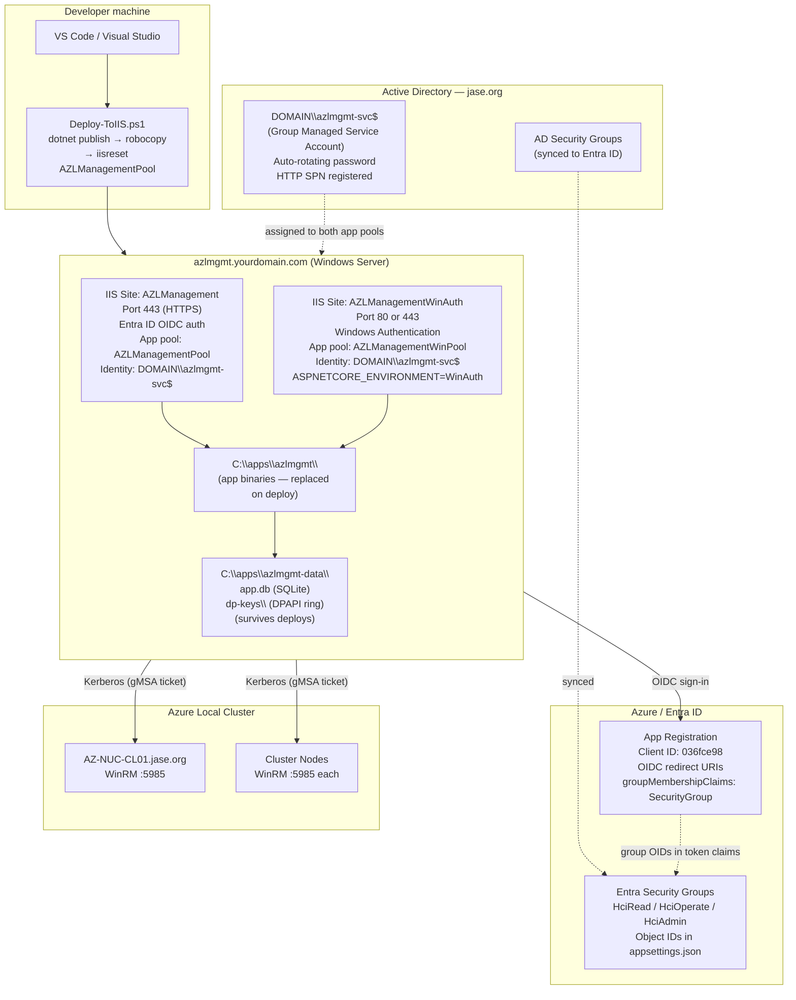

# Azure Local Cluster Tool — Architecture

This document describes the system architecture through a series of diagrams.  
All diagrams use [Mermaid](https://mermaid.js.org/) syntax (rendered by GitHub, VS Code Mermaid Preview, etc.).

---

## Contents

1. [Overall Architecture](#1-overall-architecture)
2. [Authentication & Authorisation Flow](#2-authentication--authorisation-flow)
3. [Azure ARM Connection Modes](#3-azure-arm-connection-modes)
4. [Cluster Communication & Page Caching](#4-cluster-communication--page-caching)
5. [Service Dependency Map](#5-service-dependency-map)
6. [Deployment Topology](#6-deployment-topology)

---

## 1. Overall Architecture

Shows every actor and system boundary — users, the app server, Entra ID, Azure ARM, and the on-premises cluster.

**Key points**

| Concern | Detail |
|---|---|
| App server | Single Windows Server, IIS InProcess hosting, self-contained .NET 10 executable |
| Identity for WinRM / CIM | gMSA `DOMAIN\azlmgmt-svc$` — no passwords to rotate; Kerberos ticket obtained from process identity |
| Transport hierarchy | Most reads: C# CIM API (no PS process on cluster nodes). Hyper-V / FailoverClusters mutations: local RSAT PS (`_localPool`) with `-CimSession`/`-Cluster`. WinRM RunspacePool retained for mutations lacking a local-PS equivalent. `Get-NetAdapter` remains per-node WinRM (module not on app server). |
| RSAT required | App server must have `RSAT-Hyper-V-Tools` and `RSAT-Clustering-PowerShell` installed (`Setup-Prerequisites.ps1` handles this). |
| Database | SQLite by default (`C:\apps\azlmgmt-data\app.db`); swap to SQL Server via `appsettings.json` with no code changes |
| Secret storage | Sensitive settings (SPN secrets, `AzureAd:ClientSecret`) stored AES-encrypted in DB via DPAPI; decrypted at startup before MSAL registers |

---

## 2. Authentication & Authorisation Flow

Two parallel authentication modes exist on separate IIS sites.

**Access tiers**

| Policy | Satisfied by | Typical assignment |
|---|---|---|
| `HciRead` | HciRead, HciOperate, or HciAdmin group | All staff who need view access |
| `HciOperate` | HciOperate or HciAdmin group | Operators who start/stop VMs, drain nodes |
| `HciAdmin` | HciAdmin group only | IT admins — cluster CRUD, audit log, RBAC roles |

> **HciAdmin users bypass all custom RBAC** — they always have full access regardless of role definitions.

---

## 3. Azure ARM Connection Modes

Used by Arc, AKS, logical networks, and extension pages. Controlled by `Azure:ArmAuthMode` in `appsettings.json` / Admin → Settings.

**Choosing a mode**

| Scenario | Recommended mode |
|---|---|
| Enterprise: user_impersonation allowed on app registration | OBO — audit trail maps to individuals |
| Enterprise: SPN required, writes are rare | SPN for reads + Action SPN for writes |
| Lab / single admin | OBO is simplest |

---

## 4. Cluster Communication & Page Caching

Every cluster page follows a stale-while-revalidate pattern so repeat navigation is instant.

**Transport hierarchy**

| Pool / Session | What uses it |
|---|---|
| `_pool` (WinRM RunspacePool) | Mutations needing a PS session on a cluster node: `Get-HealthFault`, `Get-NetIntent`, ATC, ECE, Arc, `GetClusterInfoAsync`, `GetSolutionUpdatesAsync` |
| `_cimSession` (C# CIM to cluster) | Reads: cluster nodes, roles, networks, CSVs, storage pools, virtual disks, physical disks |
| `_localPool` (local RSAT PS) | Hyper-V ops (Get-VM, Start/Stop/Etc, snapshots, VHD resize, CPU/memory config) and FailoverClusters mutations (Move-ClusterSharedVolume, Start/Stop-ClusterGroup, Suspend/Resume-ClusterNode, Move-ClusterVirtualMachineRole) |
| `_nodeCimSessionCache` (CIM per node) | `FetchNodeStats` (Win32_OperatingSystem, Win32_Processor, StdRegProv), VM step 2 (Get-VM -CimSession) |
| `GetOrCreateCachedRunspace` (WinRM per-node) | `GetNetworkAdaptersAsync` — NetAdapter module is only on cluster nodes |

**Why direct per-node WinRM is now rare**  
DCOM/RPC from a non-cluster machine has much higher per-call overhead than a persistent WinRM
session (`GetClusterInfoAsync` showed 14–34s with `-Cluster` vs <500ms via WinRM pool).
CIM sessions reuse a single TCP connection and bypass `wsmprovhost.exe` entirely.
Local RSAT PS with `-CimSession`/`-Cluster` uses the CIM transport internally for queries
and the existing WinRM session for mutations — no extra process on cluster nodes.

**Cache TTL: 2 minutes**  
Mutating actions (Start VM, Drain Node, etc.) call `Cache.Evict(clusterName)` after success so the next load always fetches fresh data.

---

## 5. Service Dependency Map

DI lifetime: **Singleton** = one instance for app lifetime; **Scoped** = one per HTTP request/circuit.

---

## 6. Deployment Topology

**Two IIS sites, one app binary**

| Site | Hostname | Auth | Use case |
|---|---|---|---|
| AZLManagement | `azlmgmt.yourdomain.com` | Entra ID OIDC | External / non-domain browsers, cloud users |
| AZLManagementWinAuth | `azlmgmt-win.yourdomain.com` | Windows Auth (Kerberos/NTLM) | Domain-joined browsers — single sign-on, no login prompt |

Both sites run the same published binary in `C:\apps\azlmgmt\`. The `ASPNETCORE_ENVIRONMENT=WinAuth` environment variable on the WinAuth app pool causes `appsettings.WinAuth.json` to be loaded, switching `Authentication:Scheme` to `Windows` and disabling all Entra ID MSAL registration.

---

*Last updated: March 2026*
